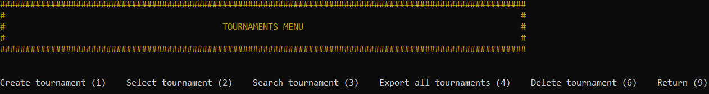
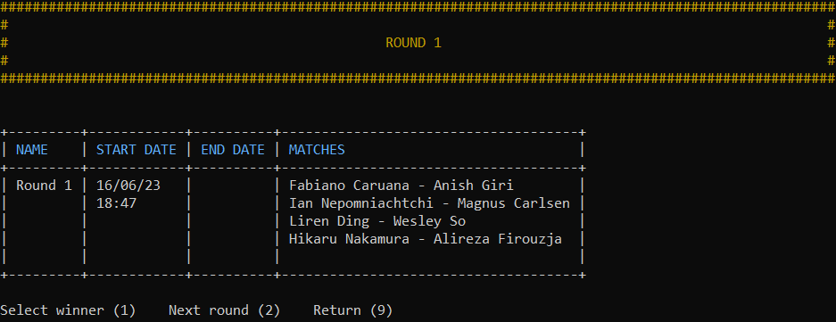

# Python Application Developer - P4 - Develop a software program in Python

## Description

A chess tournament manager for a chess club :
- tournament system : [Swiss system](https://en.wikipedia.org/wiki/Swiss-system_tournament)
- pairing system : [Monrad system](https://en.wikipedia.org/wiki/Swiss-system_tournament#Monrad_system)

## Installation guide

### Clone repository with Git :

    git clone https://github.com/johntsinger/da-python-p4.git
    
or

### Download the repository :

- On the [project page](https://github.com/johntsinger/da-python-p4)
- Click on Code
- Click on download ZIP
- Extract the file.

### Install Python :

**Requires Python 3.8 or higher**

If you don't have Python 3 or if you have an older release, please visit : https://www.python.org/downloads/ to download it !

### Virtual Environment :

#### Create a virtual environment in the project root :

Open a command prompt and go to the project location.\
Please note that `<environment name>` is a name you choose, for more convenience we use `env`.

    python -m venv <environment name>

#### Activate a virtual environment :

##### windows :

    <environment name>/Scripts/activate
    
##### linux/mac :

    source <environment name>/bin/activate
    
#### Install dependencies :

    pip install -r requirements.txt
    
## Flake8 report :

    flake8 --format=html --htmldir=flake-report
    
## Run the program :

    python main.py

### Menus :

#### Main menu :

The main menu ! You can access other menus from there.
- (1) Player menu
- (2) Tournament menu

#### Player menu :

The player menu lets you :
- (1) Create new players to the system
- (2) View and export all players registered
- (3) Delete existing players

#### Tournaments menu :

The tournaments menu lets you :
- (1) Create new tournaments
- (2) Select a tournament
- (3) Search a tournament by it's name and start date
- (4) View and export all tournaments
- (6) Delete existing tournaments

#### Tournament menu :

The tournament menu lets you :
- (1) Add players to this tournament if it hasn't already strated
- (2) Start or continue this tournament (access round menu)
- (3) View and export all players in this tournament
- (4) View and export rounds
- (5) View and export this tournament
- (6) Withdraw players (delete them from the tournament if it hans't already started otherwise they will be given a withdrawal)

#### Round menu :
The round menu lets you :
- (1) Select a winner for a given match :
  - To select a winner select the desired match
  - And select the wanted winner (1) (2) or a draw (3)
- (2) Move to the next round if all winners have been set

## Contact :
Jonathan Singer - john.t.singer@gmail.com\
Project link : https://github.com/johntsinger/da-python-p2
